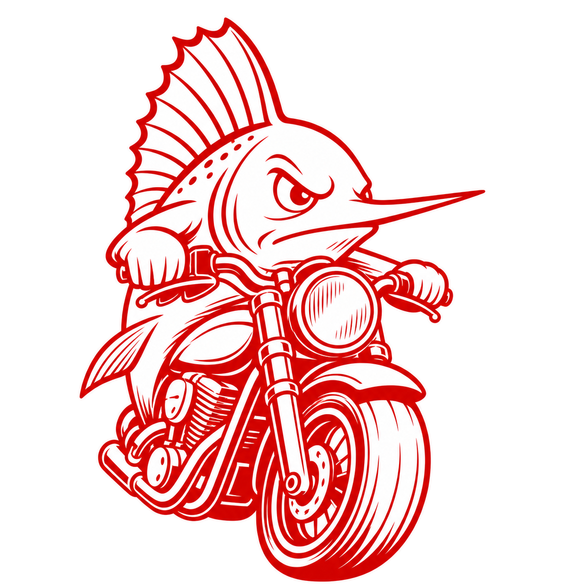

# Stumblefish

Stumblefish is a Sailfish OS location report collector for Geosubmit-compatible
services. It collects GNSS-backed Wi-Fi, cell tower, and optional BLE beacon
observations, stores reports locally, and can upload them to a configurable
submission endpoint. BeaconDB is the default endpoint.

You can use this to make quick fixes more accurate around your location, both for
you and everyone else near you.

It is heavily inspired by NeoStumbler. `https://github.com/mjaakko/NeoStumbler`.
Many thanks to them for a great tool.

## Status

Stumblefish is an early usable Sailfish OS app and user daemon.

## Features

- App and user daemon under the `org.stumblefish` namespace.
- Active and passive collection modes for background operation.
- The app UI always requests active collection while it is open.
- Wi-Fi and cell collection are enabled by default.
- BLE beacon collection is implemented but disabled by default.
- Reports are stored in SQLite before upload.
- Reports are only collected from current GNSS-backed fixes.
- Duplicate suppression avoids storing repeated observations from the same
  place and radio environment.
- Manual upload is available from the app and cover.
- Automatic upload is available, runs every 8 hours, and is disabled by
  default.
- Automatic upload is Wi-Fi-only by default, with an option to allow other
  networks.is 
- Pending and failed reports can be inspected, retried, deleted, or cleared.
- A map view shows all retained reports using viewport-only aggregated cells.
- OSM tiles are used by default with visible attribution, a stable User-Agent,
  and a disk cache. The tile URL is configurable and can be left empty to
  disable background tiles.
- Local report retention defaults to 60 days.

## Privacy Notes

- Wi-Fi SSIDs are stored with local reports and included when reports are
  uploaded to the configured endpoint.
- Hidden Wi-Fi networks and networks ending in `_nomap` are skipped.
- Location reports are not automatically uploaded unless automatic upload is
  enabled.
- Map tile requests go to the configured tile provider and may reveal viewed
  map areas to that provider.
- The default upload endpoint is `https://api.beacondb.net/v2/geosubmit`.

When "Allow background collection" is enabled, the daemon enables its user
systemd unit so it starts with the user session on boot. Otherwise it is started
on demand by the app or D-Bus activation and exits when it is no longer needed. 
Optionally, the daemon can be configured to keep positioning active so it can
constantly collect data. Otherwise, it will only do so when another app gets a
fix. Active mode will really punish your battery life.

## Project Layout

- `src/` contains the Sailfish Silica app, QML pages, icons, and client-side
  D-Bus wrapper.
- `daemon/` contains the collector daemon, storage, source collectors, map
  aggregation, settings, and upload logic.
- `common/` contains shared constants.
- `rpm/` contains Sailfish RPM packaging.

## Credits

Stumblefish is heavily based on NeoStumbler. Thanks to the NeoStumbler project
and its contributors.

The Motorcycle Fish is inspired by The Motorcycle Boy from Rumble Fish, by S.E.Hinton.
